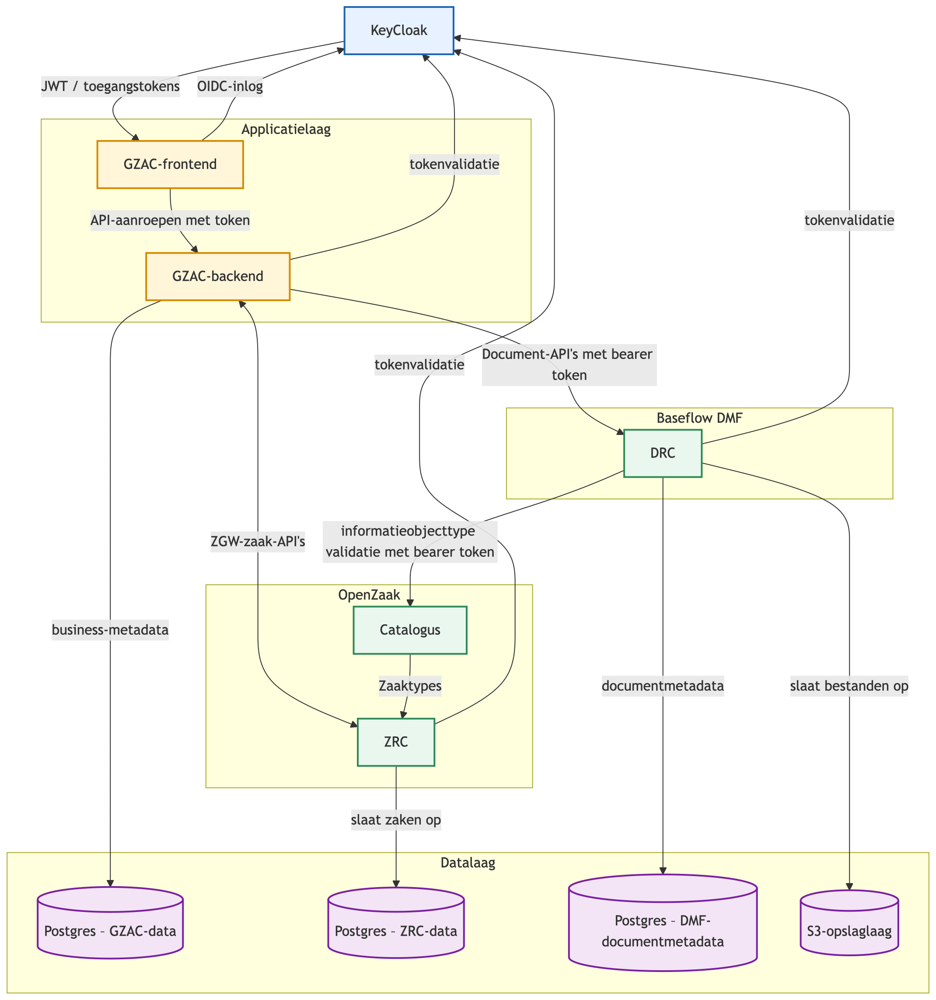

# DMF-PoC

This repository is a Proof of Concept (PoC) for a new Document Registration Component (DRC) in the Common Ground
landscape. It implements a minimal, functional version of the Documenten API, with additional filtering for new
relations between non-Zaken objects.

## Configuration

All settings are read from environment variables (or a `.env` file in development).
Copy `.env.example` to `.env` and adjust the values before starting the application.

For more details, see [docs/configuratie.md](docs/configuratie.md).

## Documentation

- [Database Migrations](docs/DATABASE.md) - Migration workflow and limitations
- [API Specification](docs/documenten-1.5.0.yaml) - OpenAPI spec
- [Document API Implementation](docs/implementatie.md) - Implementation details
- [WOPI integration](docs/wopi.md) - Document viewing integration

## Prerequisites

### macOS

```bash
brew install openjdk@21 gradle docker docker-compose
```

## Quick Start

1. **Clone and build:**

    ```bash
    git clone <repository-url>
    cd DMF-PoC
    ./gradlew build
    ```

2. **Start services:**
   The minimal services required for development can be started with Docker Compose:

    ```bash
    docker compose up -d postgres keycloak minio
    ```

    Additional service dependencies for optional features can be started with Docker Compose as well.

    ```bash
    docker compose up -d
    ```

3. **Run migrations:**
   Initialize the database with the initial layout:

    ```bash
    ./gradlew flywayMigrate
    ```

4. **Verify:**

    ```bash
    ./gradlew flywayInfo
    ```

5. **Configure**
   Copy the .env.example file to .env and fill in any configuration that you may have modified from the defaults.

## Common development tasks

### Development

```bash
# Build
./gradlew build

# Run tests
./gradlew test

# Start application
./gradlew run
```

### Use the API via Bruno

You can use [Bruno](https://www.usebruno.com) to test the API. Bruno is a Postman like tool

1. To use Bruno, open the collection located in `.bruno/CG-DMF` with the Bruno application.
2. Click the "Shield" icon next to the environment selector and switch from Sandbox to Developer mode.
3. Configure your environment at the top right of the window.
   By default for local development we connect to the openzaak instance of baseflow development cluster.

You can also run the Bruno test collection with the Bruno cli:

1. Install the Bruno cli: `npm install -g @usebruno/cli`
2. Run the collection:
   `bru run --sandbox=developer --env Localhost --env-var jwt.clientSecret=yoursecret --env-var jwt.clientId=gzac --reporter-junit results.xml`
    - This collection is also run as part of the CI pipeline, see `.github/workflows/INTEGRATION_TEST.yml` for details
    - Make sure you set the following environment variables if you want the tests to pass (otherwise no bestandsdelen
      will be created and the tests will fail):

```
BESTANDSDELEN_TRIGGER_SIZE=100000
BESTANDSDELEN_CHUNK_SIZE=100000
```

### Run integration tests that are run on build server via Docker Compose

```bash
JWT_CLIENT_SECRET=your-secret docker compose -f docker-compose.integration-test.yml up bruno --build
```

### Database Migrations

```bash
# Check migration status
./gradlew flywayInfo

# Apply pending migrations
./gradlew flywayMigrate

# Undo last migration
./flyway-undo.sh <version>

# Generate migration from Exposed models
./gradlew generateMigration -Pargs="V2__Description"
```

See [docs/DATABASE.md](docs/DATABASE.md) for detailed migration workflow.

## Releasing

Releases are driven by branch naming. The CI pipeline derives the version from the branch name — no version files need to be edited.

### Creating a release

1. Make sure `develop` is in the state you want to release.
2. Prepare a `RELEASE_NOTES.md` file in the repo root describing what changed. Include sections for each component that changed: backend, admin portal, and/or Helm chart. For example:
   ```markdown
   ## Backend
   - Initial release of the Documenten API v1.5.0 implementation

   ## Admin Portal
   - Initial release of the administrative interface

   ## Helm Chart
   - Initial release of the cg-dmf Helm chart (chart version 1.0.0)
   ```
3. Create and push a `release/X.Y.Z` branch from `develop`:
   ```bash
   git checkout develop
   git pull
   git checkout -b release/1.0.0
   git push origin release/1.0.0
   ```
4. CI will automatically:
   - Run the full test suite
   - Build and publish Docker images tagged `1.0.0` and `latest` to both Azure Container Registry and Docker Hub
   - Create a GitHub Release `v1.0.0` using the contents of `RELEASE_NOTES.md`
5. Delete `RELEASE_NOTES.md` after the release and commit that to `develop`.
6. Open a PR from `release/1.0.0` into `main` and merge it to keep `main` up to date.

### Branch tagging behaviour

| Branch | Docker image tag |
|---|---|
| `develop` | `develop-YYYYMMDDHHMM` |
| `release/X.Y.Z` | `X.Y.Z` |
| `hotfix/X.Y.Z` | `hotfix-X.Y.Z-YYYYMMDDHHMM` |
| any other branch | branch name (no timestamp, no push) |

### Hotfixes

For a fix that needs to go to production without going through `develop`:

1. Branch from `main`: `git checkout -b hotfix/1.0.1 main`
2. Apply the fix and push — CI builds a timestamped image for testing.
3. When ready, create a `release/1.0.1` branch from the hotfix branch and push it to trigger the full release.
4. Merge `release/1.0.1` into both `main` and `develop`.

## Project Structure

- `/src/main/kotlin` — Application source code
    - `documenten/` — Documenten API 1.5.0 routes and module (`com.baseflow.documenten`)
    - `infra/` — Health checks and OpenAPI spec endpoints (`com.baseflow.infra`)
    - `settings/` — Internal management endpoints (`com.baseflow.settings`)
    - `wopi/` — WOPI protocol support (planned, not yet implemented) (`com.baseflow.wopi`)
    - `shared/` - Consolidated shared code that is used across multiple domains
      - `middleware/` — Shared Ktor plugins (auth, audit trail, notifications, etc.)
      - `models/` — Shared request/response models
      - `config/` — Application configuration and dependency injection
      - `entities/` — Exposed ORM table definitions
      - `services/` — Business logic
      - `tooling/` — Gradle tasks (migration generator, OpenAPI export)
- `/src/main/resources/db/migration` — Flyway migration scripts
- `/docs` — Documentation
- `/docker` — Docker configuration

## Tech Stack

- **Language:** Kotlin
- **ORM:** Exposed 1.0.0-rc-4
- **Database:** PostgreSQL
- **Migrations:** Flyway
- **Build:** Gradle
- **API Spec:** OpenAPI 3.0 (see `docs/documenten-1.5.0.yaml`)

### Component Diagram



## License

EUPL 1.2 - See [LICENSE.md](LICENSE.md)
