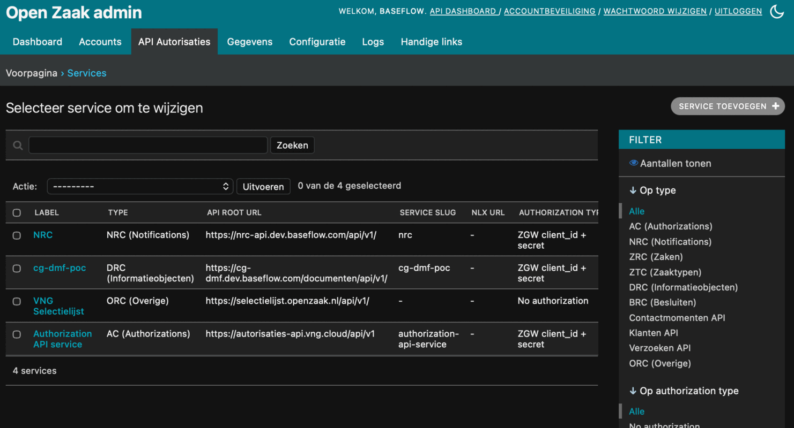
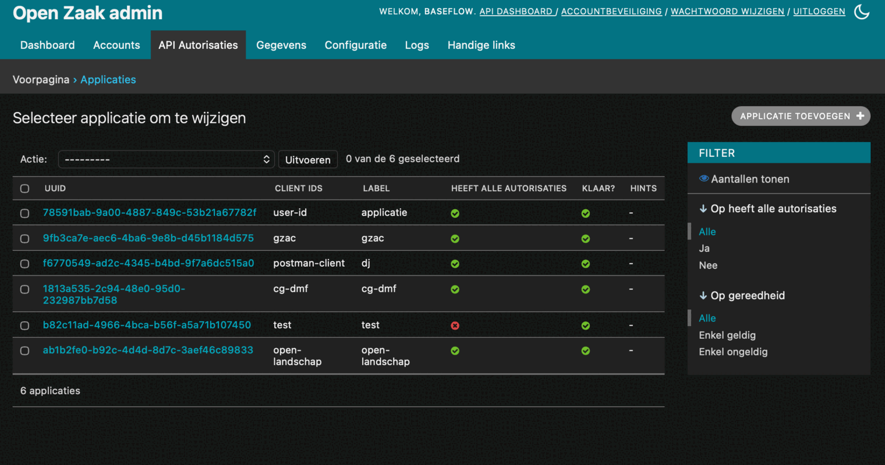
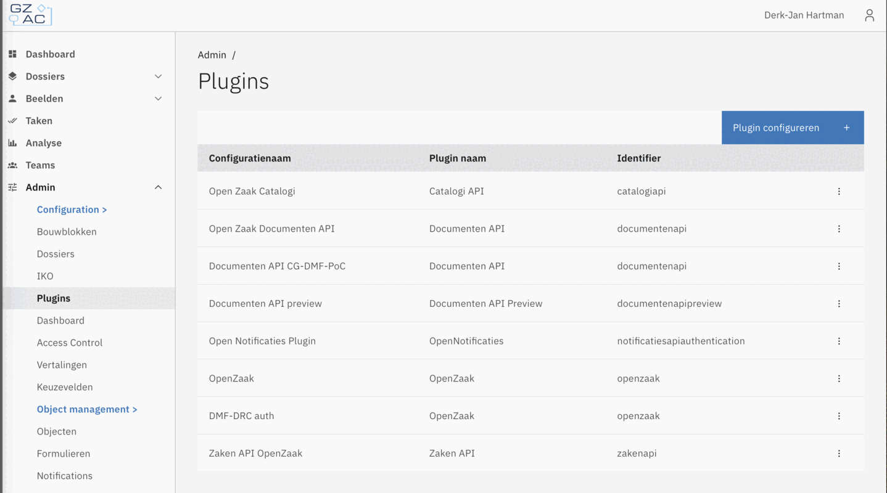
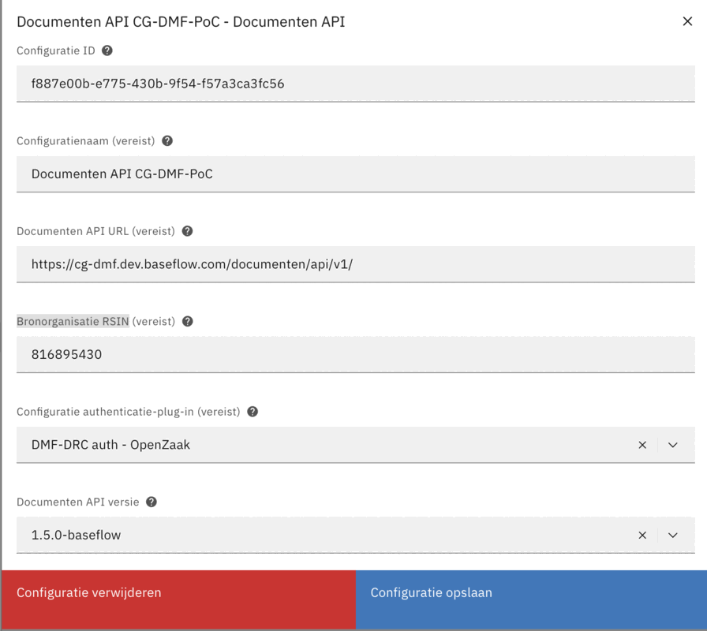

# Gebruikshandleiding

Integratie in een Common Ground landschap. Deze handleiding beschrijft hoe CG-DMF wordt geïntegreerd in een Common Ground landschap. Behandeld worden: OpenZaak, GZAC/Valtimo, IKO, Open Notificaties en WOPI.

## DMF registreren als DRC-service in OpenZaak
OpenZaak moet weten dat de CG-DMF de DRC is, zodat het objectreferenties kan valideren en aanmaken.

### Maak applicatie aan in CG-DMF

1. Log in bij de admin-portal van CG-DMF
2. Ga naar **Applicaties**
3. Klik op **Toevoegen**
4. Kies een applicatie-naam (bijv. openzaak-dmf)
5. Creëer of genereer een client-secret
6. Sla op

<table><tr>
<td></td>
<td></td>
</tr></table>

Het is ook mogelijk om met behulp van de environmentvariabele `CLIENT_SECRETS` een client-secret aa te maken.

### Registreer service in OpenZaak

1. Ga in de OpenZaak-beheerinterface naar **API autorisaties → Services**
2. Klik op **Service toevoegen**
3. Vul in:
   - **Label**: `CG-DMF`
   - **Type**: `DRC (informatieobjecten)`
   - **API root URL**: `https://cg-dmf.example.com/documenten/api/v1/`
   - **Autorisatietype**: `ZGW client_id + secret`
   - **Client id**: het client-ID waarmee CG-DMF zichzelf identificeert bij OpenZaak.
   - **Client secret**: het bijbehorende secret
   - **Gebruikers-id**: `openzaak`
   - **Gebruikersrepresentatie**: `Open Zaak`
4. Sla op



--- 

## CG-DMF toegang geven tot de OpenZaak-catalogus

De DMF valideert het `informatieobjecttype` van elk document tegen de catalogus in OpenZaak.

### Applicatie aanmaken in OpenZaak

1. Ga in OpenZaak naar **API autorisaties → Applicaties**
2. Klik op **Applicatie toevoegen**
3. Vul in:
   - **Naam**: `DMF`
   - **Client id**: kies een client-ID voor de communicatie van DMF naar OpenZaak (bijv. `cg-dmf`)
   - **Client secret**: kies een secret
   - Selecteer **Heeft alle authorisaties**, of kies in Beheer authorisaties, iig. voor alle `Documenten API` autorisaties.
4. Sla op



### API-koppeling aanmaken in CG-DMF

1. Log in bij de admin-portal van CG-DMF
2. Ga naar **API koppelingen**
3. Klik op **Toevoegen**
4. Geef de API-koppeling een naam
5. Vul in:
   - **Type** selecteer: ZTC - Catalogi API
   - **Base URL**: https://openzaak.example.com/catalogi/api/v1/
   - **Authenticatie type**: ZGW authenticatie
   - **Client ID**: Naam als aangemaakt in de vorige stap
   - **Client secret**: Secret als aangemaakt in de vorige stap
   - **Validatie**: Ja om te valideren. Dit kan uitgeschakeld worden, maar dan worden `informatieobjecttype`-waarden niet gevalideerd tegen de OpenZaak-catalogus. Valideren heeft een aanzienlijke performance-impact, maar is wel belangrijk om consistentie te bewaken.
6. Sla op
7. Herhaal deze stappen om ook de `ZRC-Zaken API` te koppelen.

<table><tr>
<td></td>
<td></td>
</tr></table>

Het is ook mogelijk om de waarden als omgevingsvariabelen in de [configuratie](/docs/configuratie.md) van de DMF in te stellen.
   ```env
   OPENZAAK_ENDPOINT=https://openzaak.example.com
   OPENZAAK_CLIENT_ID=cg-dmf
   OPENZAAK_CLIENT_SECRET=<secret>
   OPENZAAK_VALIDATION_ENABLED=true
   ```

### Zaaktypen en informatieobjecttypen aanmaken

Zorg dat in OpenZaak de benodigde zaaktypen en informatieobjecttypen zijn geconfigureerd voordat u documenten aanmaakt via GZAC.

---

## GZAC / Valtimo koppelen

### Credentials aanmaken
Maak credentials aan voor GZAC/Valtimo in zowel CG-DMF als in OpenZaak.

Zie ook:
- [Maak een applicatie aan in CG-DMF](#maak-een-applicatie-aan-in-gzac)
- [Maak een applicatie aan in OpenZaak](#applicatie-aanmaken-in-openzaak)

### 1. Authenticatie-plugins instellen
In GZAC/Valtimo is een authenticatie-plugin vereist voor communicatie met de Documenten API.

1. Navigeer in de sidebar link naar `Admin`
2. Kies hier `Plugins`
3. Kies `Plugin configureren` en voeg een nieuwe plugin toe van het type `Open Zaak`. Deze plugin implementeert de ZGW-authenticatie en kan door andere plugins gebruikt worden als authorisatie plugin.
4. Configureer de plugin met:
   - **Configuratie-naam**: bijv. `OpenZaak-auth`
   - **Client ID**: het client-ID dat u in de vorige stap heeft aangemaakt in OpenZaak
   - **Client secret**: het bijbehorende secret
5. Sla op
6. Voeg nu een tweede plugin toe van het type `Open Zaak`.
7. Configureer deze plugin met:
   - **Configuratie-naam**: bijv. `CG-DMF-auth`
   - **Client ID**: het client-ID dat u in de vorige stap heeft aangemaakt in CG-DMF
   - **Client secret**: het bijbehorende secret
8. Sla op



### 2. Zaken API-plugin instellen

Voeg nog een plugin toe van het type `Zaken API`.

Configureer de plugin met:
- **Naam**: bv. `OpenZaak Zaken API`
- **Zaken API URL**: bv. `https://openzaak.example.com/zaken/api/v1/`
- **Configuratie authenticatie-plug-in (vereist)**: de OpenZaak-authenticatieplugin (stap 1)

### 3. Documenten-plugin instellen
Voeg nog een plugin toe van het type `Documenten API`.

Configureer de plugin met:
- **Naam**: bv. `CG-DMF Documenten API`
- **Documenten API URL**: bv. `https://cg-dmf.example.com/documenten/api/v1/`
- **Bronorganisatie RSIN**: Het RSIN van de bronorganisatie waarin de documenten worden opgeslagen.
- **Configuratie authenticatie-plug-in (vereist)**: de CG-DMF authenticatieplugin (stap 1)
- **Documenten API-versie**: Kies voor `1.5.0-baseflow`. Deze versie is vereist om extra object relatie acties te kunnen gebruiken vanuit GZAC.



Raadpleeg de [GZAC/Valtimo documentatie](https://docs.valtimo.nl/features/plugins/configure-documenten-api-plugin) voor aanvullende details over de plugin-configuratie.

### 4. Systeem upload-proces aanmaken

Het systeem-uploadproces koppelt een formuliercomponent voor bestandsuploads aan de DMF en OpenZaak.

1. Ga naar **Admin → System processes → Processen**
2. Maak een nieuw proces aan met de naam `DMF upload proces`
3. Voeg toe: start event → taak **Upload document** → taak **Link document aan zaak** → eind event
4. Maak van beide taken een **service task**
5. Configureer **Upload document**:
   - **Process link → Proceskoppeling aanmaken**
   - Kies de Documenten-plugin
   - Kies **Geüpload document opslaan**
6. Configureer **Link document aan zaak**:
   - **Process link → Proceskoppeling aanmaken**
   - Kies de OpenZaak-plugin
   - Kies **Koppel geüpload document aan zaak**
7. Sla het proces op

### 5. Dossier aanmaken

1. Ga naar **Admin → Configuratie → Dossiers** en maak een nieuw dossier aan
2. Ga naar **Formulieren** en maak drie formulieren aan:
   - **Start**: enkel een submit-knop
   - **Upload**: bevat het DMF-uploadcomponent (zie hieronder)
   - **Eind**: standaard submit-knop
3. Voeg in het Upload-formulier het **Documenten API upload**-component toe:
   - Stel onder **Advanced** de sectie `DMF upload proces` in
   - Stel de property in als `documentenApiUrl`
4. Ga naar **Processen** en maak een gebruikersproces aan:
   - Start event → user task **Upload document** → user task **Afronden** → end event
   - Koppel de formulieren aan de overeenkomstige taken via **Process link**
5. Ga naar **Algemeen** en stel in:
   - **Uploadproces**: `Documenten API upload document`
   - Vink aan: **Start een nieuw dossier** en **Door de gebruiker te starten**
   - Koppel het start-formulier aan het start event
6. Ga naar **ZGW** en stel in:
   - Controleer: **De Documenten API-plugin gebruikt versie 1.5.0**
   - Kies een **zaaktype** uit de catalogus
   - Stel de **OpenZaak-plugin** in
   - Kies **Automatisch aanmaken voor elk dossier**
7. Ga naar **Document** en zet `additionalProperties` op `true`
8. Activeer de dossierversie via **Meer → Actief maken**

---

## IKO — Integraal Klant Objectbeeld

IKO is een systeem dat naast GZAC kan worden ingezet om via diverse API's een geïntegreerd overzicht te tonen van informatie rondom een klant of zaak (het "beeld"). IKO kan de Documenten API van CG-DMF bevragen om documenten op te nemen in dit overzicht.

### Koppeling

IKO communiceert met de Documenten API via ZGW client credentials. Maak een credential aan via de admin portal (zie [installatie.md — Client credentials](installatie.md#client-credentials)) en configureer deze in IKO als authenticatiemethode voor de DMF.

Stel de **Documenten API URL** in IKO in op:
```
https://cg-dmf.example.com/documenten/api/v1/
```

Raadpleeg de IKO-documentatie voor de specifieke configuratiestappen in IKO zelf.

---

## Open Notificaties

CG-DMF kan events publiceren naar een Open Notificaties-instantie wanneer documenten worden aangemaakt,
bijgewerkt of verwijderd.

### Configuratie

Open Notificaties zijn standaard niet ingeschakeld. Stel hiervoor de volgende omgevingsvariabelen in:

```env
NOTIFICATION_API_URL=https://notificaties.example.com/api/v1
NOTIFICATION_API_TOKEN=<bearer-token-met-notificaties.publiceren-scope>
NOTIFICATION_KANAAL=documenten
NOTIFICATION_SOURCE=drc
```

Wanneer `NOTIFICATION_API_URL` leeg is, zijn notificaties uitgeschakeld.

### Kanaal registreren

Het kanaal `documenten` moet bestaan in Open Notificaties voordat de DMF er events op kan publiceren. Maak het kanaal aan via de Open Notificaties-beheerinterface als het nog niet bestaat.

### Autorisatie in Open Notificaties

De DMF heeft een Bearer-token nodig met de scope `notificaties.publiceren`. Maak dit token aan in de Open Notificaties-beheerinterface en stel het in als `NOTIFICATION_API_TOKEN`.

---

## WOPI — In-browser documentweergave

CG-DMF implementeert een WOPI-host waarmee een WOPI-client (bijv. Collabora Online) documenten rechtstreeks vanuit de DRC kan openen en tonen in de browser.

Zie [wopi/wopi.md](wopi/wopi.md) voor de volledige WOPI-integratiehandleiding.

### Snelconfiguratie

```env
WOPI_ENABLED=true
WOPI_HOST_BASE_URL=https://cg-dmf.example.com
WOPI_CLIENT_BASE_URL=https://collabora.example.com
```

Een frontend opent een document door een HTML-formulier te POSTen naar de Collabora-URL met het WOPI-source-pad en een JWT-token. Zie [wopi/wopi.md](wopi/wopi.md) voor een werkend voorbeeldbestand.

