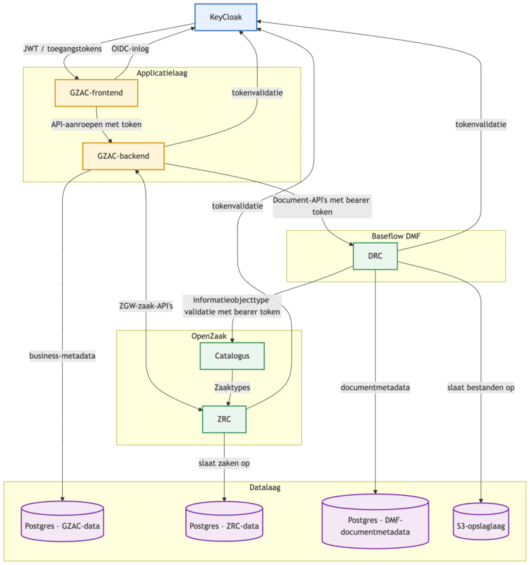
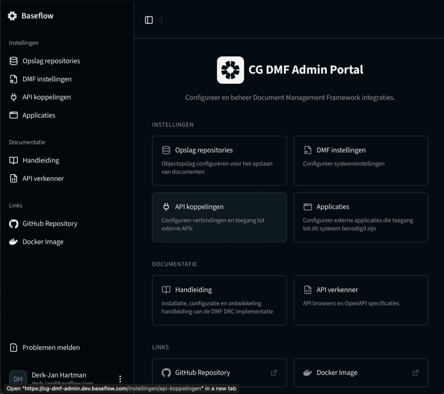
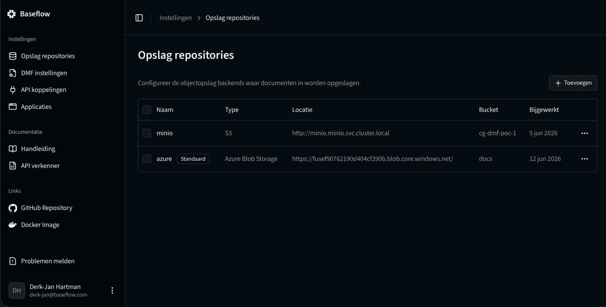
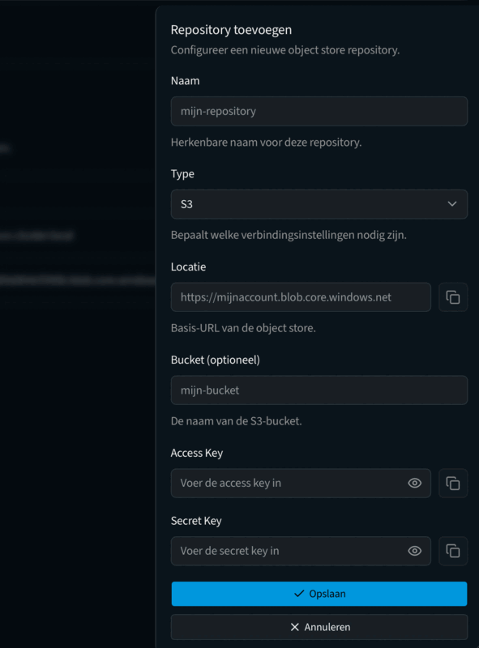
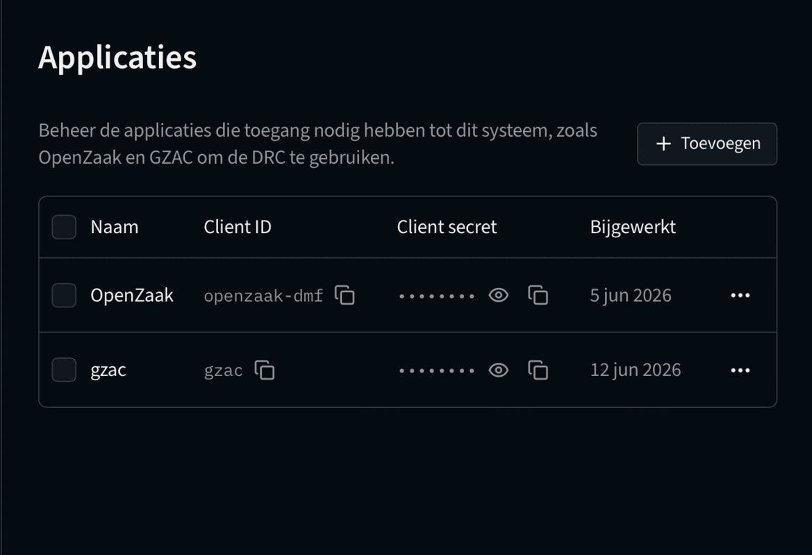
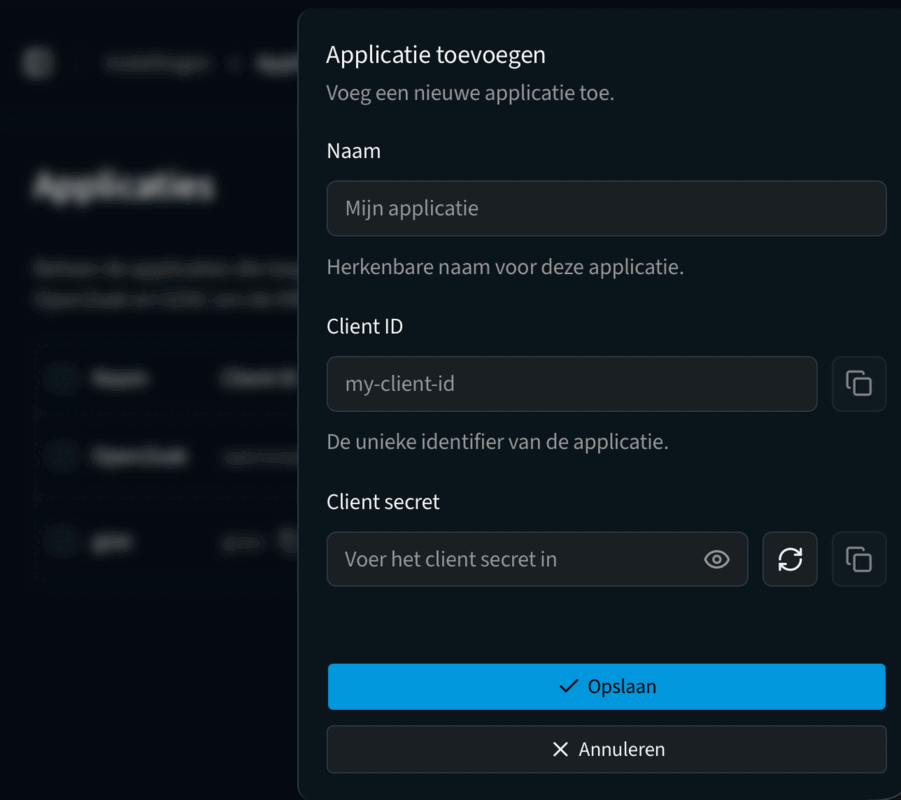
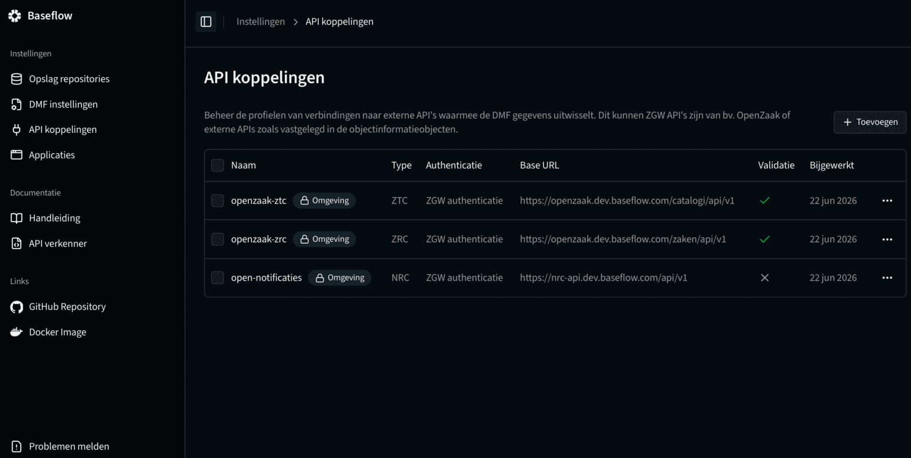
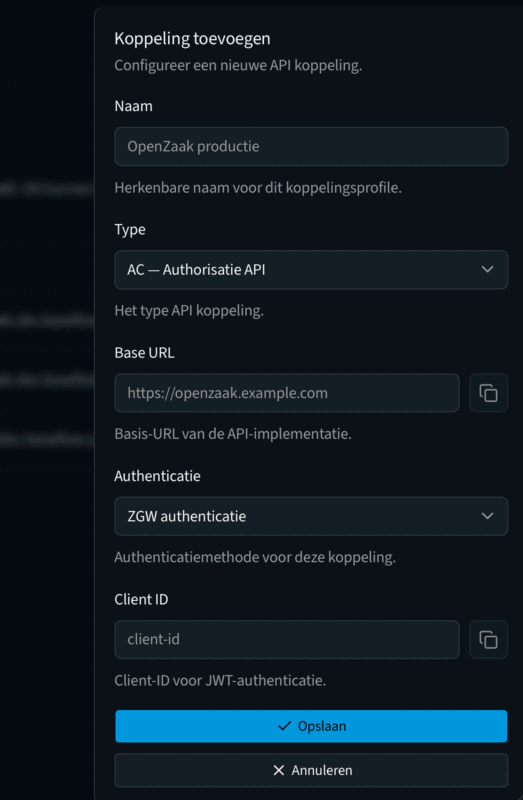

# Installatiehandleiding

Deze handleiding beschrijft hoe u CG-DMF DRC in productie installeert. Voor lokale ontwikkeling, zie [ontwikkeling.md](ontwikkeling.md).

## Inhoudsopgave

- [Architectuuroverzicht](#architectuuroverzicht)
- [Vereisten](#vereisten)
- [Optie A: Helm chart](#optie-a-helm-chart)
- [Optie B: Docker Compose (server)](#optie-b-docker-compose-server)
- [Keycloak configuratie](#keycloak-configuratie)
- [Admin portal](#admin-portal)
  - [Blob-opslagrepositories](#blob-opslagrepositories)
  - [Client credentials](#client-credentials)
- [OpenZaak registreren](#openzaak-registreren)

## Architectuuroverzicht

In een typische Common Ground opstelling neemt CG-DMF de rol van DRC (Document Registratie Component) op zich naast OpenZaak:





CG-DMF hoeft niet samen te worden geïnstalleerd met OpenZaak — het kan ook als standalone DRC fungeren voor systemen die geen Zaken gebruiken.

## Vereisten

### Infrastructuur

| Component               | Minimale versie | Opmerking                                                                |
|-------------------------|-----------------|--------------------------------------------------------------------------|
| PostgreSQL              | 14              | 16 aanbevolen                                                            |
| Blob-opslag             | —               | S3-compatibel (MinIO, AWS S3) of Azure Blob Storage                      |
| OIDC-provider           | —               | Keycloak aanbevolen; zie [Keycloak configuratie](#keycloak-configuratie) |
| Reverse proxy / Ingress | —               | Nginx, Traefik of vergelijkbaar                                          |

---

## Optie A: Helm chart

De meegeleverde Helm chart (`helm/cg-dmf`) biedt een volledig configureerbare installatie met ondersteuning voor external secrets, HPA en de admin portal.

Zie [`helm/cg-dmf/README.md`](../helm/cg-dmf/README.md) voor de volledige installatiehandleiding en configuratie documentatie.

In het kort:

```bash
helm install cg-dmf ./helm/cg-dmf \
  -f my-values.yaml \
  --namespace cg-dmf \
  --create-namespace
```

---

## Optie B: Docker Compose (server)

Deze opstelling draait de gepubliceerde Docker-images direct op een server zonder Kubernetes.

### 1. Maak een werkdirectory aan

```bash
mkdir cg-dmf && cd cg-dmf
```

### 2. Maak een `docker-compose.yml`

```yaml
services:
  app:
    image: baseflow/cg-dmf-poc:latest
    restart: unless-stopped
    depends_on:
      postgres:
        condition: service_healthy
    env_file: .env
    ports:
      - "8080:8080"

  admin-portal:
    image: baseflow/cg-dmf-admin-portal:latest
    restart: unless-stopped
    env_file: .env.admin
    ports:
      - "3000:3000"

  postgres:
    image: postgres:16
    restart: unless-stopped
    environment:
      POSTGRES_DB: documenten
      POSTGRES_USER: documenten
      POSTGRES_PASSWORD: ${DB_PASSWORD}
    volumes:
      - postgres_data:/var/lib/postgresql/data
    healthcheck:
      test: ["CMD-SHELL", "pg_isready -U documenten"]
      interval: 10s
      timeout: 5s
      retries: 5

volumes:
  postgres_data:
```

### 3. Maak een `.env`-bestand voor de backend

```env
# Database
DB_URL=jdbc:postgresql://postgres:5432/documenten
DB_USER=documenten
DB_PASSWORD=wijzig_dit

# Authenticatie
OIDC_ISSUER=https://auth.example.com/realms/cg-dmf
OIDC_RESOURCE_CLIENT_ID=

# Versleuteling (genereer met: openssl rand -base64 32 / openssl rand -hex 16)
ENCRYPTION_SECRET_KEY=
ENCRYPTION_SALT=

# Blob-opslag (S3-voorbeeld)
BLOB_STORAGE_TYPE1=S3
BLOB_STORAGE_URL1=https://s3.example.com
BLOB_STORAGE_ACCESS_KEY1=
BLOB_STORAGE_SECRET_KEY1=
BLOB_STORAGE_BUCKET1=documenten

# OpenZaak
OPENZAAK_ENDPOINT=https://openzaak.example.com
OPENZAAK_CLIENT_ID=cg-dmf
OPENZAAK_CLIENT_SECRET=
OPENZAAK_VALIDATION_ENABLED=true
```

Zie [configuratie.md](configuratie.md) voor een volledige beschrijving van alle variabelen.

Blob-opslagrepositories en client credentials kunnen na de eerste start ook worden beheerd via de admin portal (zie [Eerste ingebruikname — Admin portal](#admin-portal)) zonder de applicatie te herstarten of `.env` te bewerken.

### 4. Maak een `.env.admin`-bestand voor de admin portal

```env
NEXTAUTH_URL=https://admin.cg-dmf.example.com
NEXTAUTH_SECRET=genereer_met_openssl_rand_base64_32
KEYCLOAK_URL=https://auth.example.com
KEYCLOAK_REALM=cg-dmf
KEYCLOAK_CLIENT_ID=dmf-dashboard
KEYCLOAK_CLIENT_SECRET=
BACKEND_URL=https://cg-dmf.example.com
```

### 5. Start de stack

```bash
docker compose up -d
```

De backend is beschikbaar op poort 8080, de admin portal op poort 3000. Stel een reverse proxy in om HTTPS en de publieke URL te verzorgen.

### 6. Reverse proxy

Stel uw reverse proxy zo in dat:
- `https://cg-dmf.example.com` → `http://localhost:8080`
- `https://admin.cg-dmf.example.com` → `http://localhost:3000`

Let op dat de proxy geen beperkingen oplegt aan de requestgrootte: bij grote bestandsuploads zijn timeouts en body-size-limieten van belang. Zie ook [configuratie.md — Ingress en paden](configuratie.md#ingress-en-paden) voor welke paden extern bereikbaar moeten zijn.

---

## Keycloak configuratie

CG-DMF valideert binnenkomende JWT-tokens via een OIDC-provider. De onderstaande stappen beschrijven de inrichting met Keycloak.
Bij gebruik van docker-compose worden deze automatisch geïmporteerd, maar let erop dat de standaard setup niet geschikt is voor productie doeleinden.

### 1. Realm aanmaken

Maak een nieuwe realm aan (bijv. `cg-dmf`) of gebruik een bestaande realm. Noteer de issuer-URL:

```
https://auth.example.com/realms/cg-dmf
```

Dit is de waarde voor `OIDC_ISSUER`.

### 2. Rol aanmaken

Maak een realm-rol aan voor beheertoegang:

1. Ga naar **Realm roles** → **Create role**
2. Naam: `dmf-admin` (of pas aan via `ADMIN_ROLE`)
3. Sla op

Wijs de rol toe aan gebruikers die toegang nodig hebben tot de admin portal (`/settings/**`).

### 3. Client aanmaken voor de admin portal

De admin portal gebruikt OAuth2 authorization code flow.

1. Ga naar **Clients** → **Create client**
2. Client type: `OpenID Connect`
3. Client ID: `dmf-dashboard` (of uw eigen keuze — stel `KEYCLOAK_CLIENT_ID` dienovereenkomstig in)
4. Zet **Client authentication** op `On` (confidential client)
5. Stel de **Valid redirect URIs** in: `https://admin.cg-dmf.example.com/*`
6. Stel de **Web origins** in: `https://admin.cg-dmf.example.com`
7. Ga naar **Credentials** en kopieer het client secret — dit is `KEYCLOAK_CLIENT_SECRET`

Zorg dat de client de rol `dmf-admin` kan meegeven in het token:
1. Ga naar **Clients** → uw client → **Client scopes** → de standaard scope (bijv. `dmf-dashboard-dedicated`)
2. Voeg een **Role mapper** toe die `realm_access.roles` includeert in het token

### 4. Client aanmaken voor GZAC / ZGW consumers

GZAC en vergelijkbare consumers authenticeren via ZGW client credentials (geen OIDC).
Maak deze credentials aan via de admin portal (zie [Admin portal — Client credentials](#client-credentials)) of via de omgevingsvariabele `CLIENT_CREDENTIALS`.

---

## Admin portal

De admin portal is bereikbaar op de URL die u heeft ingesteld als `NEXTAUTH_URL` (standaard: `https://admin.cg-dmf.example.com`). Inloggen gaat via Keycloak; gebruikers hebben de rol `dmf-admin` nodig (instelbaar via `ADMIN_ROLE`).



> Veel van de opties in de admin portal kunnen ook vanuit environment variabelen worden geconfigureerd. Zie hiervoor [configuratie.md](configuratie.md).

### Blob-opslagrepositories

Onder **Opslag** beheert u de gekoppelde S3- of Azure Blob-repositories. Per repository configureert u:

- Naam, type (S3 of Azure Blob Storage), URL, bucket/container
- Toegangssleutel en geheime sleutel (worden versleuteld opgeslagen)




U kunt meerdere repositories aanmaken. Er kan op dit moment maar één repository tegelijk actief zijn voor nieuwe uploads. Om de **Standaard** repository te wijzigen kies in het dropdown menu voor `Maak standaard repository`. Ook is het mogelijk om een repository uit te schakelen door hem te bewerken.

> Blob-opslagrepositories kunnen ook worden geconfigureerd via omgevingsvariabelen (`BLOB_STORAGE_*1`) — zie [configuratie.md](configuratie.md). Dit is handig voor geautomatiseerde of containergebaseerde deployments. Deze repositories zijn zichtbaar in de admin portal maar kunnen daar niet bewerkt worden.

### Applicaties



Onder **Applicaties** beheert u de ZGW-authenticatiegegevens voor systemen zoals GZAC (en OpenZaak). Per gebruikersysteem van de DMF-DRC maakt u een client aan met:

- Een client ID (bijv. `gzac`, `openzaak`)
- Een client secret (automatisch gegenereerd of zelf in te stellen)

Nadat deze zijn aangemaakt kunt u deze instellen in het andere systeem. Bijv. bij de service instellingen in OpenZaak, of in een authenticatie plugin in GZAC.

> Client credentials kunnen ook worden ingesteld via de omgevingsvariabele `CLIENT_CREDENTIALS` (kommagescheiden `client_id:secret`-paren). Dit is handig voor geautomatiseerde of containergebaseerde deployments.

### API-koppelingen



Onder API-koppelingen is het mogelijk om externe APIs die het systeem nodig heeft te registreren. Dit kunnen verschilellende systemen zijn zoals de ZRC en ZTC componenent, maar bijvoorbeeld ook de URLs die geregistreerd worden als `objectinformatieobject`-relaties van een document.

## OpenZaak registreren
Registreer de DMF als DRC-service in OpenZaak zodat OpenZaak de URLs van de DMF herkent. Zie [handleiding.md — OpenZaak koppelen](handleiding.md#openzaak-koppelen) voor de stappen.

